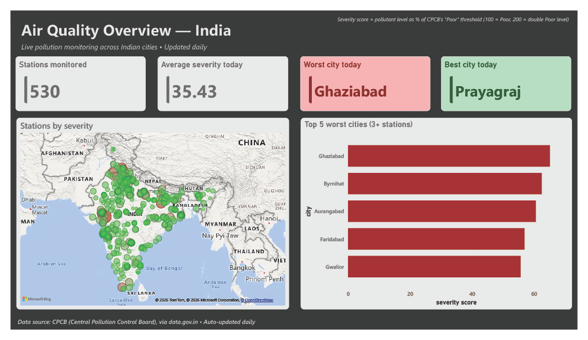
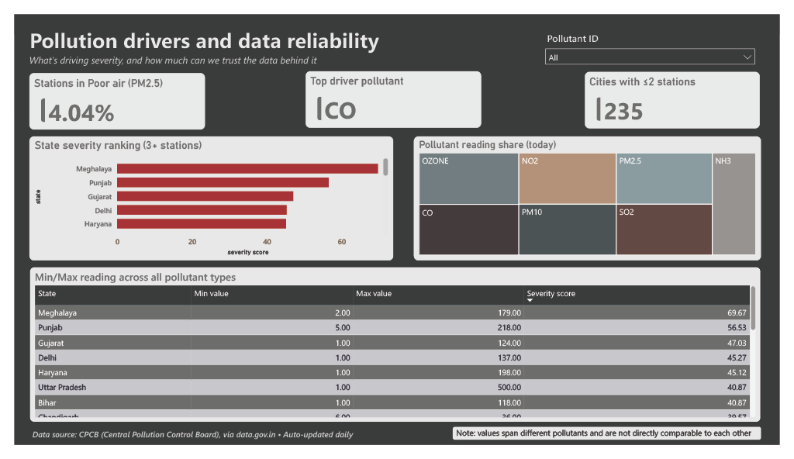
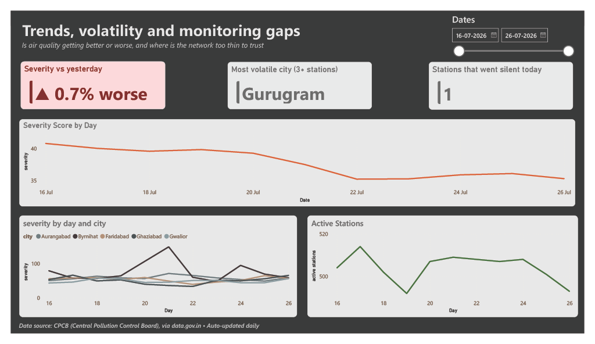

# Real-Time Air Quality Analytics Pipeline

> An automated, end-to-end pipeline that collects, cleans, and analyzes real-time air quality data across 500+ Indian monitoring stations, surfaced through a 3-page interactive Power BI dashboard.

---

## 📌 Table of Contents

- [Project Overview](#project-overview)
- [Business Problem](#business-problem)
- [Project Objectives](#project-objectives)
- [Dataset](#dataset)
- [Data Dictionary](#data-dictionary)
- [Project Structure](#project-structure)
- [Data Preparation](#data-preparation)
- [Data Cleaning](#data-cleaning)
- [Data Transformation](#data-transformation)
- [Data Analysis](#data-analysis)
- [Database Design](#database-design)
- [Dashboard](#dashboard)
- [How to Read This Dashboard](#how-to-read-this-dashboard)
- [Key Performance Indicators](#key-performance-indicators)
- [Key Insights](#key-insights)
- [Recommendations](#recommendations)
- [Project Workflow](#project-workflow)
- [How to Run the Project](#how-to-run-the-project)
- [Results](#results)
- [Future Improvements](#future-improvements)
- [Project Limitations](#project-limitations)

---

## 📊 Project Overview

This project builds a fully automated pipeline that pulls live air quality 
data from India's Central Pollution Control Board (CPCB) every day, cleans 
and stores it, and presents it through an interactive Power BI dashboard.

Unlike a one-time analysis on a static downloaded dataset, this pipeline 
runs unattended on a daily schedule, meaning the underlying dataset — and 
the dashboard built on top of it — grows and updates automatically over 
time. Anyone monitoring air quality trends, prioritizing pollution-control 
resources, or researching environmental patterns in India could use this 
as a foundation.

---

## ❓ Business Problem

Raw pollution readings, on their own, don't tell decision-makers where to 
act. A single number like "AQI: 180" doesn't reveal whether that's a 
citywide problem or one faulty sensor, whether it's getting better or 
worse, or which specific pollutant needs addressing.

This project was built to answer three connected, decision-relevant 
questions:

1. **Right now** — is the air safe, and where is it worst?
2. **Drivers** — which pollutants and regions need urgent intervention, 
   and how reliable is the underlying data behind that judgment?
3. **Trends** — is air quality improving or worsening over time, and 
   where are gaps in the monitoring network hiding the real picture?

---

## 🎯 Project Objectives

- Build a fully automated pipeline requiring no manual data collection
- Normalize pollutant readings (PM2.5, NO2, SO2, CO, etc.) onto a single 
  comparable severity scale, since raw values differ by orders of magnitude 
  across pollutant types
- Identify and correct for statistical reliability issues (e.g., cities 
  with only 1 monitoring station producing misleading rankings)
- Design a 3-page dashboard that separates "current state," "root cause," 
  and "trend over time" into distinct, purpose-built views
- Document data quality limitations transparently rather than presenting 
  numbers without context

---

## 📁 Dataset

### Dataset Description
Real-time air quality readings from CPCB monitoring stations across India, 
covering pollutant concentrations (PM2.5, PM10, NO2, SO2, CO, OZONE, NH3) 
per station, refreshed daily.

### Data Source
- **Source:** [data.gov.in](https://data.gov.in) — Real-Time Air Quality 
  Index API, maintained by the Central Pollution Control Board (CPCB), 
  Ministry of Environment, Forest and Climate Change, Government of India
- **Format:** JSON, via REST API
- **Collection method:** automated daily pull (Python + Windows Task 
  Scheduler)
- **Coverage:** 500+ stations across India, growing daily since pipeline 
  launch

### Dataset Files
| File/Table | Description |
|---|---|
| `stations` | One row per unique monitoring station (name, city, state, coordinates) |
| `readings` | One row per pollutant reading per station per day |
| `pollutant_thresholds` | CPCB's official severity breakpoints per pollutant, used for normalization |

---

## 📖 Data Dictionary

**`stations`**
| Column | Description | Type |
|---|---|---|
| `station_id` | Unique station identifier (auto-generated) | INT |
| `station_name` | Name of the monitoring station | VARCHAR |
| `city` | City the station is located in | VARCHAR |
| `state` | State the station is located in | VARCHAR |
| `country` | Country (always India) | VARCHAR |
| `latitude` / `longitude` | Geographic coordinates | DECIMAL |

**`readings`**
| Column | Description | Type |
|---|---|---|
| `reading_id` | Unique reading identifier (auto-generated) | INT |
| `station_id` | Links to `stations` table | INT |
| `pollutant_id` | Pollutant type (PM2.5, NO2, SO2, CO, PM10, OZONE, NH3) | VARCHAR |
| `min_value` / `max_value` / `avg_value` | Reported concentration range and average | DECIMAL |
| `last_update` | Timestamp of the reading, as reported by CPCB | DATETIME |
| `fetched_at` | Timestamp when this pipeline collected the reading | DATETIME |

**`pollutant_thresholds`**
| Column | Description | Type |
|---|---|---|
| `pollutant_id` | Pollutant type | VARCHAR |
| `good_max` / `satisfactory_max` / `moderate_max` / `poor_max` / `very_poor_max` | CPCB's official concentration breakpoints per severity category | DECIMAL |

---

## 📂 Project Structure

```text
AQI-Analytics-Project/
│
├── python/
│   ├── main.py                 # runs the full pipeline end-to-end
│   ├── fetch.py                # pulls data from the CPCB API
│   ├── clean.py                # cleans and type-converts raw data
│   ├── load.py                 # inserts cleaned data into MySQL
│   ├── config_template.py      # copy to config.py with your own credentials
│   └── requirements.txt
│
├── sql/
│   └── create_tables.sql
│
├── powerbi/
│   ├── AQI_Dashboard.pbix
│   └── screenshots/
│       ├── page1_overview.png
│       ├── page2_drivers.png
│       └── page3_trends.png
│
├── excel/
│   └── AQI_Snapshot_Summary.xlsx
│
├── .gitignore
└── README.md
```

---

## 🧹 Data Preparation

- Data is collected via a REST API call to CPCB's live endpoint, requesting 
  the exact number of currently available records rather than a hardcoded 
  limit (record counts vary day to day as stations report or drop offline)
- Raw JSON responses are inspected to confirm field structure before 
  building a fixed schema, since API field names didn't always match 
  official documentation
- All numeric and date fields arrive as plain text from the API and require 
  explicit type conversion before analysis

---

## 🧽 Data Cleaning

**Missing values:** rows with missing or unparseable coordinates, pollutant 
values, or timestamps are dropped after conversion (`errors="coerce"` turns 
invalid entries into nulls, which are then filtered out).

**Invalid readings:** rows with zero or negative pollutant values are 
removed, since these typically indicate sensor errors rather than real 
measurements.

**Duplicate records:** two layers of protection — (1) duplicates within a 
single API pull are dropped using `pandas.drop_duplicates()`, and (2) a 
MySQL `UNIQUE` constraint on `(station_id, pollutant_id, last_update)` 
combined with `INSERT IGNORE` prevents duplicate rows even if the pipeline 
runs more than once on the same day.

**Data types:** `pd.to_numeric()` converts text fields to proper numeric 
types; `pd.to_datetime()` converts CPCB's `DD-MM-YYYY HH:MM:SS` date format 
into standard datetime values MySQL can store correctly.

---

## 🔄 Data Transformation

- **Severity Score:** a custom normalized metric expressing each pollutant 
  reading as a percentage of CPCB's official "Poor" threshold for that 
  specific pollutant — this makes PM2.5, NO2, SO2, CO, and other pollutants 
  directly comparable despite very different natural measurement scales
- **Reliability filtering:** city and state-level aggregations exclude 
  locations with fewer than 3 monitoring stations, since single-sensor 
  readings proved to heavily skew rankings during development (see Key 
  Insights)
- **Date-latest filtering:** several dashboard metrics use DAX measures 
  that dynamically identify and filter to the most recent reporting date, 
  so the dashboard always reflects current data without manual updates

---

## 🔍 Data Analysis

### Business Questions Explored
1. Which cities currently have the most/least severe air quality?
2. Which pollutant is the dominant driver of poor air quality nationally?
3. What percentage of monitoring stations report "Poor" or worse PM2.5 
   levels?
4. How many cities lack sufficient monitoring infrastructure for reliable 
   comparison?
5. Is air quality improving or worsening day-over-day?
6. Which cities show the most volatile (unstable) pollution patterns, 
   versus chronically stable ones?
7. Is the monitoring network itself reliable over time, or are there 
   coverage gaps that could be mistaken for improved air quality?

---

## 🗄️ Database Design

### Tables
| Table | Description |
|---|---|
| `stations` | Reference data — one row per monitoring station |
| `readings` | Transactional data — grows daily, one row per pollutant reading |
| `pollutant_thresholds` | Reference data — CPCB's severity breakpoints per pollutant |

### Relationships
- `readings.station_id` → `stations.station_id` (many-to-one: many 
  readings belong to one station)
- `readings.pollutant_id` → `pollutant_thresholds.pollutant_id` (many-to-one: 
  many readings share one pollutant's threshold definition)
- This normalized design avoids repeating station details (name, city, 
  coordinates) across thousands of daily readings

---

## 📈 Dashboard

### Page 1 — Public Overview
**Purpose:** answers "is the air safe right now, and where?" at a glance.



### Page 2 — Pollution Drivers & Data Reliability
**Purpose:** answers "what's driving severity, and how much can the data 
be trusted?"



### Page 3 — Trends, Volatility & Monitoring Gaps
**Purpose:** answers "is it getting better or worse, and where is the 
network too thin to trust?"



---

## How to Read This Dashboard

**Severity Score** is a normalized metric built specifically for this 
project: each pollutant reading is expressed as a percentage of CPCB's 
official "Poor" threshold for that pollutant. A score of 100 means a 
reading sits exactly at the "Poor" boundary; 200 means double that level. 
This makes otherwise incomparable pollutants (PM2.5, NO2, SO2, CO, etc.) 
directly comparable on one scale.

**Reliability filtering:** any ranking of "most/least polluted" city or 
state only includes locations with 3+ monitoring stations. A single sensor 
can report an unusual value due to a local event or hardware fault; 
requiring multiple stations reduces this noise. Over 200 of the 500+ cities 
in the raw dataset have too few stations to be ranked reliably, and are 
excluded from ranking visuals for this reason.

**Network health (Page 3):** a drop in the active station count means data 
is *missing* that day, not that pollution improved. This chart exists 
specifically to prevent a coverage gap from being misread as an 
environmental improvement.

---

## 📌 Key Performance Indicators

| KPI | Description |
|---|---|
| Stations Monitored | Total active monitoring stations in the latest pull |
| Average Severity Today | Mean normalized severity score across all readings |
| Worst / Best City Today | Most / least severe reliable city (3+ stations) |
| % Stations in Poor Air (PM2.5) | Share of stations exceeding CPCB's PM2.5 "Poor" threshold |
| Top Driver Pollutant | Pollutant with the highest normalized severity nationally |
| Day-over-Day Change | % change in average severity vs. the previous reporting date |
| Most Volatile City | Reliable city with the highest day-to-day standard deviation in readings |

---

## 💡 Key Insights

**Raw pollutant values are not directly comparable across pollutant types.** 
Early in development, averaging raw `avg_value` readings across all 
pollutants produced misleading results — pollutants like CO and NH3 are 
naturally measured on much higher numeric scales than PM2.5 or NO2, which 
biased every "worst pollutant" and "worst city" calculation toward whichever 
pollutant simply had bigger numbers. This was resolved by normalizing every 
reading against CPCB's official pollutant-specific thresholds.

**Small sample sizes produce unreliable rankings.** Over 200 of the ~500+ 
monitored cities have only 1-2 stations. Before filtering for this, city 
rankings were dominated by obscure, single-station towns where one unusual 
reading skewed the entire "average" — not real pollution signal. All 
ranking visuals now require a minimum of 3 stations per location.

**Data reliability and pollution severity are separate concerns.** A city 
can have severe pollution *and* reliable data, severe pollution with 
*unreliable* data (single sensor), or anything in between. The dashboard 
deliberately surfaces both dimensions side by side (Page 2) rather than 
presenting a single ranking that conflates them.

**Missing data can look like good news if not flagged.** A drop in active 
reporting stations could be misread as "air quality improved," when it 
actually means monitoring coverage dropped. Page 3's network health chart 
exists specifically to prevent this misinterpretation.

---

## 📋 Recommendations

1. Prioritize pollution-control interventions using the reliability-filtered 
   state and city rankings (Page 2), not raw unfiltered averages.
2. Treat the 200+ low-coverage cities as an infrastructure gap in their own 
   right — expanding monitoring there is a prerequisite to trusting any 
   pollution data for those locations.
3. Investigate cities flagged as "most volatile" (Page 3) differently from 
   chronically severe ones — volatility suggests event-driven causes 
   (e.g., seasonal burning, localized industrial activity) that may need 
   different interventions than steady, structural pollution.
4. Monitor the network health chart alongside severity trends; a sudden 
   "improvement" coinciding with a drop in active stations should be 
   investigated before being reported as good news.

---

## 🔁 Project Workflow

```text
CPCB API
   ↓
Python — Fetch (adaptive record count, error handling)
   ↓
Python — Clean (type conversion, validation, duplicate removal)
   ↓
MySQL — Load (duplicate-safe insert, normalized schema)
   ↓
Power BI — Normalize (custom severity scoring, reliability filtering)
   ↓
Power BI — 3-page interactive dashboard
   ↓
Excel — Static snapshot summary
```

This pipeline runs automatically every day via Windows Task Scheduler — no 
manual steps required after initial setup.

---

## ⚙️ How to Run the Project

### 1. Clone the repository
```bash
git clone https://github.com/aarchi128/aqi-analytics-pipeline.git
cd aqi-analytics-pipeline/python
```

### 2. Install dependencies
```bash
pip install -r requirements.txt
```

### 3. Configure credentials
Copy `config_template.py` to `config.py` and fill in:
- A free CPCB API key and resource ID from [data.gov.in](https://data.gov.in)
- Your local MySQL host, username, password

### 4. Set up the database
Run `sql/create_tables.sql` in MySQL Workbench (or CLI) to create the schema.

### 5. Run the pipeline
```bash
python main.py
```

### 6. Open the dashboard
Open `powerbi/AQI_Dashboard.pbix` in Power BI Desktop and connect it to 
your local MySQL database when prompted.

---

## 📊 Results

The pipeline has run automatically since launch, growing the dataset daily 
without manual intervention. The dashboard consistently surfaces 
geographically plausible results — states like Punjab, Haryana, and Delhi 
regularly rank among the highest severity, consistent with known real-world 
pollution patterns (agricultural burning, high traffic density, and 
industrial activity in these regions) — which helped validate that the 
normalization and reliability-filtering logic produces trustworthy output, 
not just technically-functioning code.

---

## 🚀 Future Improvements

- Implement full CPCB breakpoint-based AQI calculation (the current 
  Severity Score is a simplified single-threshold normalization, chosen as 
  a practical proxy given time constraints)
- Backfill historical data using CPCB's bulk data portal for longer-term 
  trend analysis beyond the pipeline's live run
- Automate Excel snapshot regeneration alongside the daily Python run
- Add automated alerting (e.g., email) when severity crosses a defined 
  threshold in a reliable city

---

## ⚠️ Project Limitations

- Severity Score is a simplified proxy, not CPCB's official multi-pollutant 
  AQI formula, which requires more complex breakpoint interpolation
- The 3-station reliability threshold is a reasonable but somewhat 
  arbitrary cutoff — it reduces but doesn't eliminate small-sample noise
- Historical depth is limited to however long the automated pipeline has 
  been running since launch, rather than a full multi-year archive
- Network health tracking currently only compares day-over-day station 
  counts, not the specific stations that go offline

---

*This project's underlying dataset updates daily via an automated pipeline. 
Screenshots and figures reflect the date they were captured and will differ 
from the live dashboard.*